# Satoshi's Quest - Deployment Guide

## Table of Contents
1. [Prerequisites](#prerequisites)
2. [Local Development Setup](#local-development-setup)
3. [Smart Contract Deployment](#smart-contract-deployment)
4. [Frontend Deployment](#frontend-deployment)
5. [Post-Deployment Configuration](#post-deployment-configuration)
6. [Testing & Verification](#testing--verification)
7. [Production Checklist](#production-checklist)
8. [Troubleshooting](#troubleshooting)

---

## Prerequisites

### Required Tools

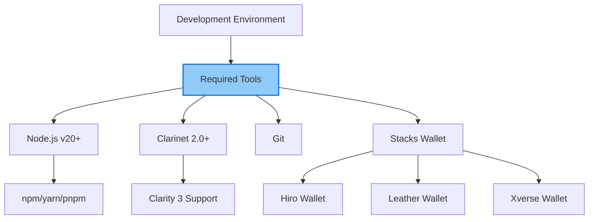

### Installation Commands

```bash
# Install Node.js (using nvm)
curl -o- https://raw.githubusercontent.com/nvm-sh/nvm/v0.39.0/install.sh | bash
nvm install 20
nvm use 20

# Install Clarinet
curl -sL https://get.clarinet.sh | sh

# Verify installations
node --version    # Should be v20.x.x
npm --version     # Should be v10.x.x
clarinet --version # Should be v2.x.x
```

### Required Accounts

1. **Stacks Testnet Wallet**
   - Get testnet STX from [faucet](https://explorer.hiro.so/sandbox/faucet?chain=testnet)
   - Need ~5 STX for contract deployments

2. **GitHub Account** (for frontend deployment)

3. **sBTC Testnet Tokens** (for testing)
   - Use sBTC testnet faucet
   - Get test sBTC for resurrection testing

---

## Local Development Setup

### Project Structure

```
satoshiquest/
├── contract/              # Smart contracts
│   ├── contracts/         # Clarity contracts
│   ├── tests/             # Contract tests
│   ├── Clarinet.toml      # Clarinet configuration
│   └── deployments/       # Deployment plans
│
├── frontend/              # Next.js frontend
│   ├── app/               # App router pages
│   ├── components/        # React components
│   ├── lib/               # Services & utilities
│   ├── public/            # Static assets
│   └── package.json
│
├── docs/                  # Documentation
└── resources/             # Reference materials
```

### Clone & Install

```bash
# Clone repository
git clone https://github.com/your-org/satoshiquest.git
cd satoshiquest

# Install frontend dependencies
cd frontend
npm install

# Go back to contract directory
cd ../contract
```

### Environment Setup

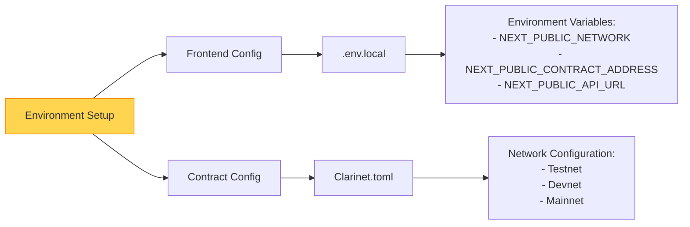

#### Frontend Environment (`.env.local`)

```bash
# Network Configuration
NEXT_PUBLIC_NETWORK=testnet
NEXT_PUBLIC_STACKS_API=https://api.testnet.hiro.so

# Contract Addresses (update after deployment)
NEXT_PUBLIC_CORE_CONTRACT=ST2F3J1PK46D6XVRBB9SQ66PY89P8G0EBDW5E05M7.satoshi-quest-core
NEXT_PUBLIC_LOOT_CONTRACT=ST2F3J1PK46D6XVRBB9SQ66PY89P8G0EBDW5E05M7.satoshi-quest-loot
NEXT_PUBLIC_TOMBSTONE_CONTRACT=ST2F3J1PK46D6XVRBB9SQ66PY89P8G0EBDW5E05M7.satoshi-quest-tombstone
NEXT_PUBLIC_RESURRECTION_CONTRACT=ST2F3J1PK46D6XVRBB9SQ66PY89P8G0EBDW5E05M7.satoshi-quest-resurrection

# sBTC Token
NEXT_PUBLIC_SBTC_CONTRACT=SM3VDXK3WZZSA84XXFKAFAF15NNZX32CTSG82JFQ4.sbtc-token
```

### Local Testing

```bash
# Start frontend development server
cd frontend
npm run dev
# Access at http://localhost:3000

# In another terminal, test contracts
cd contract
clarinet console
```

---

## Smart Contract Deployment

### Deployment Order

**IMPORTANT**: Contracts must be deployed in this specific order to avoid circular dependencies:

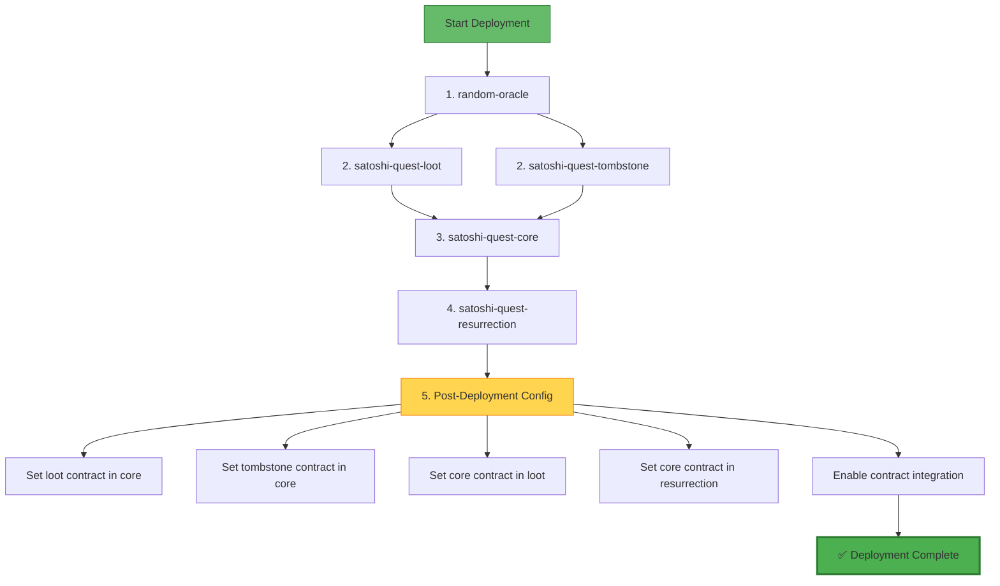

### Step-by-Step Deployment

#### 1. Prepare Deployment Account

```bash
# Generate deployment wallet or use existing
clarinet integrate

# Add your wallet configuration to Clarinet.toml
# [accounts.deployer]
# mnemonic = "your twelve word mnemonic here..."
# balance = 5000000000  # 5000 STX
```

#### 2. Check Contracts

```bash
# Verify all contracts compile
clarinet check

# Should see:
# ✅ All contracts compile successfully
```

#### 3. Deploy to Testnet

```bash
# Deploy all contracts
clarinet deployments apply -p deployments/default.simnet-plan.yaml --testnet

# This will:
# - Deploy contracts in correct order
# - Output deployment addresses
# - Create deployment report
```

#### 4. Manual Deployment (Alternative)

If automated deployment fails, deploy manually:

```bash
# 1. Deploy random-oracle
clarinet deploy contract/contracts/random-oracle.clar random-oracle --testnet

# 2. Deploy loot contract
clarinet deploy contract/contracts/satoshi-quest-loot.clar satoshi-quest-loot --testnet

# 3. Deploy tombstone contract
clarinet deploy contract/contracts/satoshi-quest-tombstone.clar satoshi-quest-tombstone --testnet

# 4. Deploy core contract
clarinet deploy contract/contracts/satoshi-quest-core.clar satoshi-quest-core --testnet

# 5. Deploy resurrection contract
clarinet deploy contract/contracts/satoshi-quest-resurrection.clar satoshi-quest-resurrection --testnet
```

#### 5. Record Contract Addresses

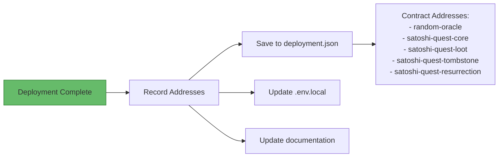

Create `deployment.json`:

```json
{
  "network": "testnet",
  "deployer": "ST2F3J1PK46D6XVRBB9SQ66PY89P8G0EBDW5E05M7",
  "contracts": {
    "random-oracle": "ST2F3J1PK46D6XVRBB9SQ66PY89P8G0EBDW5E05M7.random-oracle",
    "satoshi-quest-core": "ST2F3J1PK46D6XVRBB9SQ66PY89P8G0EBDW5E05M7.satoshi-quest-core",
    "satoshi-quest-loot": "ST2F3J1PK46D6XVRBB9SQ66PY89P8G0EBDW5E05M7.satoshi-quest-loot",
    "satoshi-quest-tombstone": "ST2F3J1PK46D6XVRBB9SQ66PY89P8G0EBDW5E05M7.satoshi-quest-tombstone",
    "satoshi-quest-resurrection": "ST2F3J1PK46D6XVRBB9SQ66PY89P8G0EBDW5E05M7.satoshi-quest-resurrection"
  },
  "deployedAt": "2025-01-18T12:00:00Z"
}
```

---

## Post-Deployment Configuration

### Contract Linking

After deployment, contracts need to be linked together using admin functions:

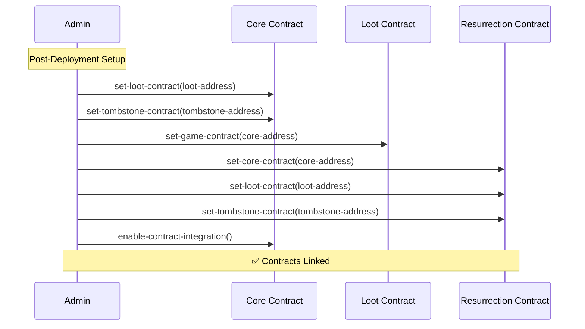

### Configuration Script

```typescript
// scripts/configure-contracts.ts
import { makeContractCall, broadcastTransaction } from '@stacks/transactions'

async function configureContracts() {
  const deployer = 'ST2F3J1PK46D6XVRBB9SQ66PY89P8G0EBDW5E05M7'

  // 1. Set loot contract in core
  await makeContractCall({
    contractAddress: deployer,
    contractName: 'satoshi-quest-core',
    functionName: 'set-loot-contract',
    functionArgs: [principalCV(`${deployer}.satoshi-quest-loot`)],
    network: new StacksTestnet()
  })

  // 2. Set tombstone contract in core
  await makeContractCall({
    contractAddress: deployer,
    contractName: 'satoshi-quest-core',
    functionName: 'set-tombstone-contract',
    functionArgs: [principalCV(`${deployer}.satoshi-quest-tombstone`)],
    network: new StacksTestnet()
  })

  // 3. Set core contract in loot
  await makeContractCall({
    contractAddress: deployer,
    contractName: 'satoshi-quest-loot',
    functionName: 'set-game-contract',
    functionArgs: [principalCV(`${deployer}.satoshi-quest-core`)],
    network: new StacksTestnet()
  })

  // 4. Set contracts in resurrection
  await makeContractCall({
    contractAddress: deployer,
    contractName: 'satoshi-quest-resurrection',
    functionName: 'set-core-contract',
    functionArgs: [principalCV(`${deployer}.satoshi-quest-core`)],
    network: new StacksTestnet()
  })

  // 5. Enable integration
  await makeContractCall({
    contractAddress: deployer,
    contractName: 'satoshi-quest-core',
    functionName: 'enable-contract-integration',
    functionArgs: [],
    network: new StacksTestnet()
  })

  console.log('✅ Contracts configured successfully')
}

configureContracts()
```

---

## Frontend Deployment

### Build Process

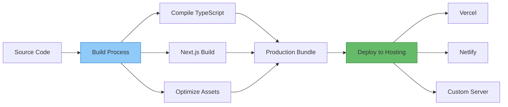

### Vercel Deployment

```bash
# Install Vercel CLI
npm install -g vercel

# Login to Vercel
vercel login

# Deploy
cd frontend
vercel --prod

# Follow prompts:
# - Link to existing project or create new
# - Set environment variables
# - Deploy
```

### Environment Variables on Vercel

```bash
# Set via Vercel dashboard or CLI
vercel env add NEXT_PUBLIC_NETWORK production
vercel env add NEXT_PUBLIC_STACKS_API production
vercel env add NEXT_PUBLIC_CORE_CONTRACT production
# ... add all environment variables
```

### Build Configuration

```json
// vercel.json
{
  "buildCommand": "npm run build",
  "devCommand": "npm run dev",
  "installCommand": "npm install",
  "framework": "nextjs",
  "outputDirectory": ".next"
}
```

---

## Testing & Verification

### Contract Testing

```bash
# Run unit tests
clarinet test

# Test specific contract
clarinet test --filter satoshi-quest-core

# Integration tests
clarinet integrate
```

### Frontend Testing

```bash
# Run development server
npm run dev

# Test build
npm run build
npm start

# Check production build
npm run build && npm run start
```

### Verification Checklist

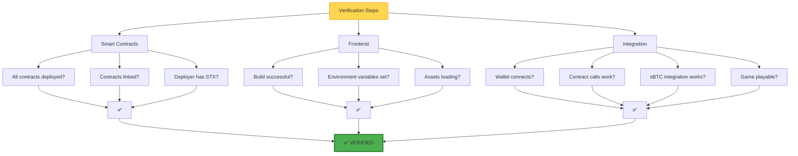

### Manual Testing Procedure

1. **Wallet Connection**
   ```
   ✅ Connect Hiro Wallet
   ✅ Connect Leather Wallet
   ✅ Display correct balance
   ✅ Network detection works
   ```

2. **Game Functionality**
   ```
   ✅ Game loads properly
   ✅ Character movement works
   ✅ Combat system functions
   ✅ Loot drops appear
   ✅ Floor progression works
   ```

3. **Blockchain Integration**
   ```
   ✅ NFT minting works
   ✅ Tombstone creation works
   ✅ sBTC balance displays
   ✅ Resurrection gambling works
   ✅ Events emit correctly
   ```

---

## Production Checklist

### Pre-Launch

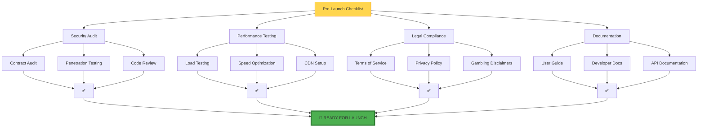

### Launch Day

1. **Final Deployment**
   ```bash
   # Deploy to mainnet
   clarinet deployments apply --mainnet

   # Verify contracts on explorer
   # https://explorer.hiro.so/txid/{tx_id}?chain=mainnet

   # Deploy frontend
   vercel --prod

   # Verify frontend
   # https://satoshiquest.io
   ```

2. **Monitoring Setup**
   ```bash
   # Set up monitoring
   - Sentry for error tracking
   - Google Analytics for usage
   - Custom blockchain monitoring
   ```

3. **Announcement**
   ```
   - Tweet launch announcement
   - Post on Discord/Telegram
   - Update documentation
   - Monitor for issues
   ```

### Post-Launch Monitoring

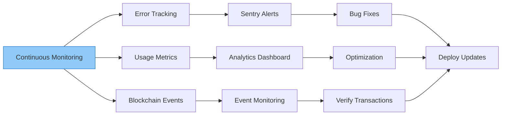

---

## Troubleshooting

### Common Issues

#### 1. Contract Deployment Fails

```bash
# Error: Insufficient balance
# Solution: Get more STX from faucet
clarinet deploy --help

# Error: Contract already exists
# Solution: Use different contract name or deployer address

# Error: Circular dependency
# Solution: Deploy in correct order (see deployment section)
```

#### 2. Frontend Build Errors

```bash
# Error: Environment variables not found
# Solution: Create .env.local with all required vars

# Error: Module not found
# Solution: npm install

# Error: TypeScript errors
# Solution: npm run build -- --no-type-check
```

#### 3. Wallet Connection Issues

```
Problem: Wallet not connecting
Solution:
- Check browser extension is installed
- Clear browser cache
- Try different wallet
- Check network (testnet vs mainnet)
```

#### 4. Transaction Failures

```
Problem: Contract call fails
Solution:
- Check post-conditions
- Verify contract address
- Ensure sufficient STX balance
- Check function arguments
```

### Debug Mode

```typescript
// Enable debug logging
localStorage.setItem('DEBUG', 'satoshiquest:*')

// In code
if (process.env.NODE_ENV === 'development') {
  console.log('Debug info:', data)
}
```

### Support Resources

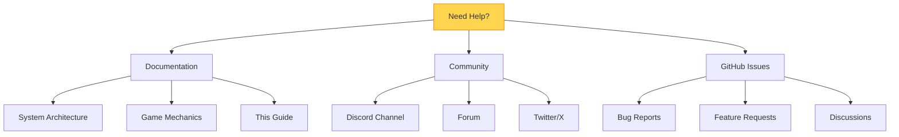

---

## Maintenance

### Regular Tasks

```bash
# Weekly
- Monitor error logs
- Check transaction volume
- Review user feedback
- Update dependencies

# Monthly
- Security review
- Performance audit
- Backup data
- Update documentation

# Quarterly
- Major version updates
- Feature releases
- Community events
- Financial reports
```

### Update Procedure

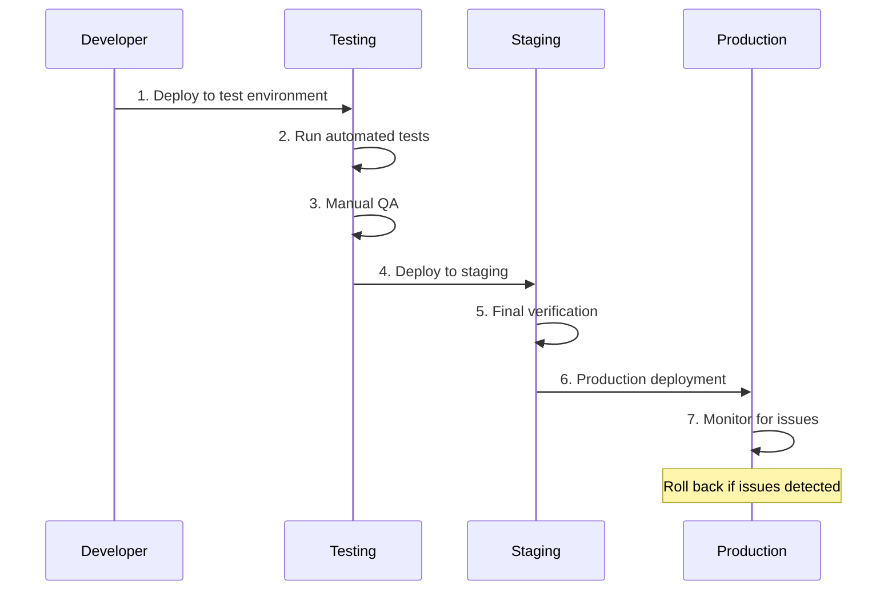

---

## Next Steps

Now that you've deployed Satoshi's Quest:

1. **Test thoroughly** - Verify all functionality
2. **Monitor closely** - Watch for any issues
3. **Engage community** - Gather feedback
4. **Iterate quickly** - Fix bugs and add features

For more information:
- [SYSTEM_ARCHITECTURE.md](./SYSTEM_ARCHITECTURE.md) - System design
- [GAME_MECHANICS.md](./GAME_MECHANICS.md) - Game rules
- [SBTC_RESURRECTION_FLOW.md](./SBTC_RESURRECTION_FLOW.md) - sBTC mechanics

---

**Last Updated**: January 2025
**Version**: 1.0.0
**Authors**: Satoshi's Quest Development Team
