# Satoshi's Quest - Game Mechanics Documentation

## Table of Contents
1. [Overview](#overview)
2. [Character System](#character-system)
3. [Combat System](#combat-system)
4. [Loot System](#loot-system)
5. [Progression System](#progression-system)
6. [Death & Permadeath](#death--permadeath)
7. [Floor System](#floor-system)
8. [Ancient Satoshi Coin](#ancient-satoshi-coin)

---

## Overview

Satoshi's Quest is a **rogue-like dungeon crawler** with permanent consequences. Every decision matters because death is permanent and recorded on the Bitcoin blockchain.

### Game Genre
- **Rogue-like**: Procedurally generated dungeons, permadeath, turn-based combat
- **Blockchain-Native**: All significant events are recorded on-chain
- **Bitcoin-Backed**: Real economic value through sBTC integration

### Core Loop

```mermaid
graph LR
    A[Explore Dungeon] --> B[Find Treasure/Monsters]
    B --> C[Combat or Loot]
    C --> D[Gain XP/Items]
    D --> E[Level Up]
    E --> F[Descend Deeper]
    F --> A

    C -.Death.-> G[Permadeath]
    G --> H[Tombstone NFT]
    H -.sBTC Gamble.-> I{Resurrection?}
    I -->|Win| A
    I -->|Lose| J[Game Over]

    style G fill:#ef5350,stroke:#c62828
    style I fill:#ffd54f,stroke:#f57c00
    style J fill:#424242,stroke:#212121
```

---

## Character System

### Character Stats

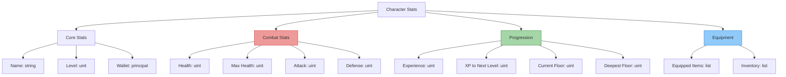

### Starting Stats

```typescript
const initialCharacter: GameCharacter = {
  id: 'player-{wallet-hash}',
  name: 'Hero of Bitcoin',
  level: 1,
  health: 100,
  maxHealth: 100,
  attack: 10,
  defense: 5,
  experience: 0,
  experienceToNext: 100,
  currentFloor: 1,
  deepestFloor: 1,
  equipped: [],
  isAlive: true,
  wallet: walletAddress
}
```

### Stat Scaling

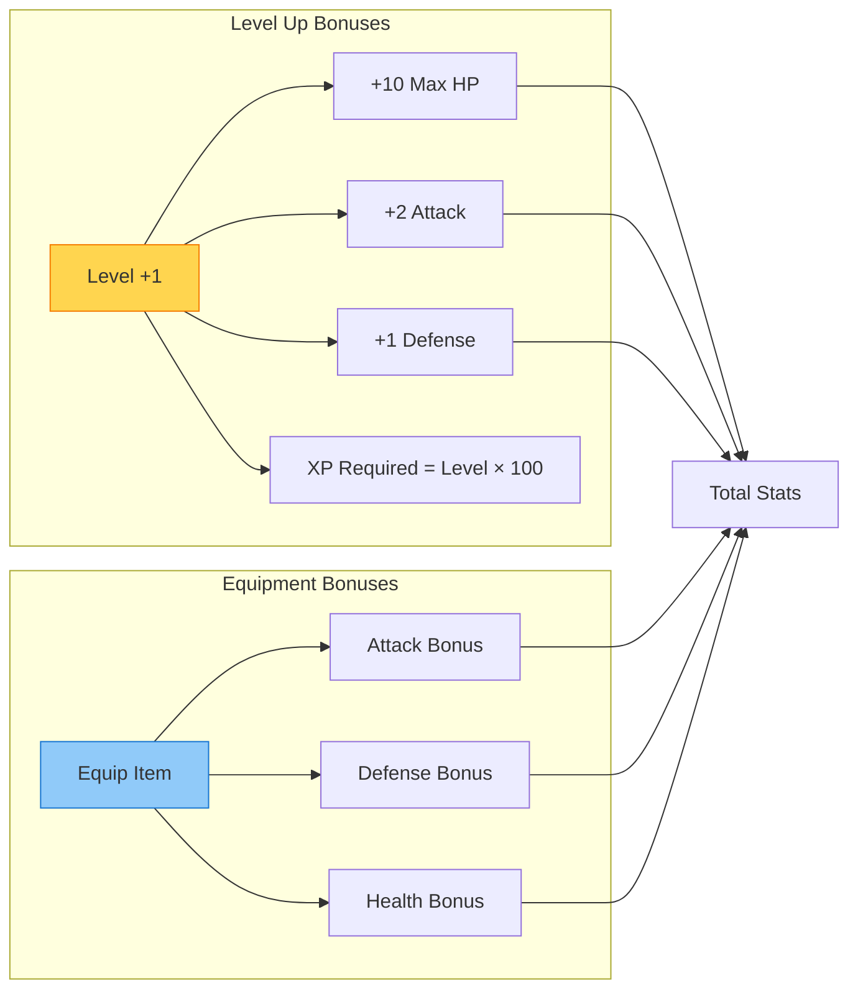

---

## Combat System

### Combat Flow

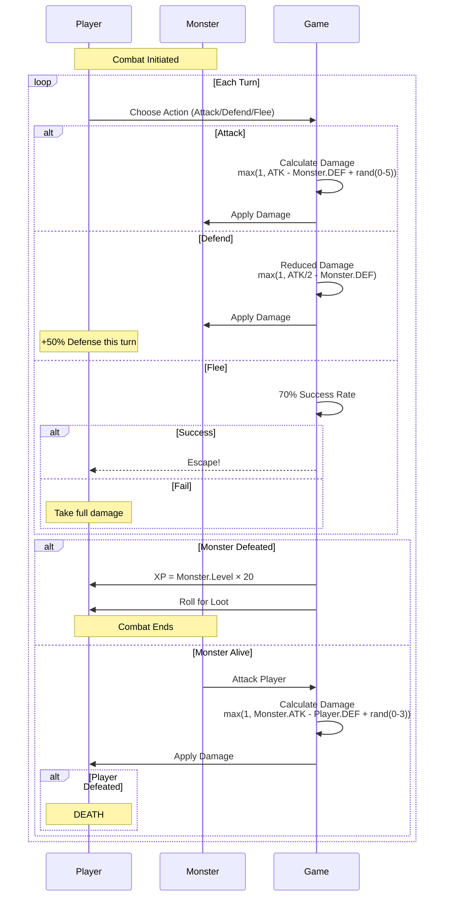

### Combat Formulas

#### Player Damage
```typescript
// Attack Action
playerDamage = max(1, player.attack - monster.defense + random(0, 5))

// Defend Action
playerDamage = max(1, floor(player.attack / 2) - monster.defense)
monsterDamage = max(1, monster.attack - (player.defense * 1.5)) // Player takes less damage

// Flee Action
fleeSuccess = random(0, 100) < 70 // 70% chance
```

#### Monster Damage
```typescript
monsterDamage = max(1, monster.attack - player.defense + random(0, 3))
```

### Monster Scaling

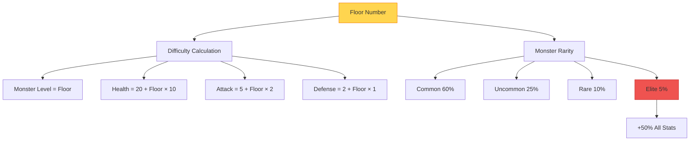

---

## Loot System

### Loot Rarity Tiers

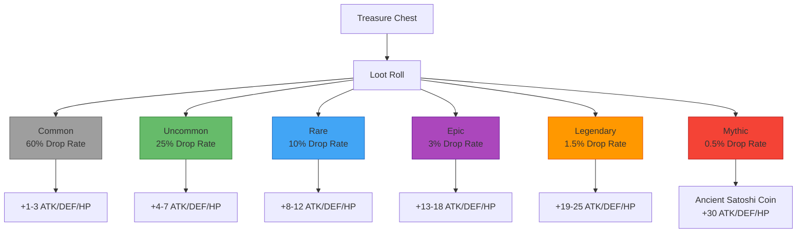

### Loot Generation Algorithm

```typescript
function generateLoot(floor: number): LootItem {
  const rarityRoll = random(0, 1000)

  // Rarity determination (0.1% increments)
  let rarity: LootRarity
  if (rarityRoll < 5) rarity = 'mythic'        // 0.5%
  else if (rarityRoll < 20) rarity = 'legendary' // 1.5%
  else if (rarityRoll < 50) rarity = 'epic'      // 3%
  else if (rarityRoll < 150) rarity = 'rare'     // 10%
  else if (rarityRoll < 400) rarity = 'uncommon' // 25%
  else rarity = 'common'                          // 60%

  // Special case: Ancient Satoshi Coin
  if (rarity === 'mythic' && floor >= 10) {
    return createAncientSatoshiCoin()
  }

  // Stat bonuses based on rarity
  const bonusRanges = {
    common: [1, 3],
    uncommon: [4, 7],
    rare: [8, 12],
    epic: [13, 18],
    legendary: [19, 25],
    mythic: [30, 40]
  }

  const [min, max] = bonusRanges[rarity]

  return {
    id: generateUniqueId(),
    name: generateItemName(rarity, floor),
    rarity,
    attackBonus: random(min, max),
    defenseBonus: random(min, max),
    healthBonus: random(min * 5, max * 5),
    floor,
    mintedAsNFT: false
  }
}
```

### NFT Minting Criteria

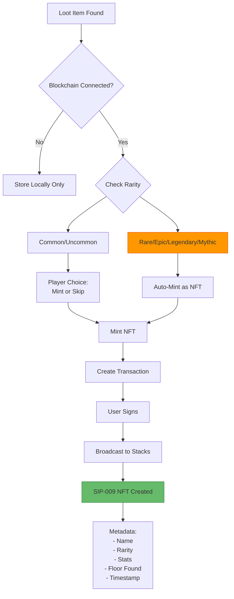

---

## Progression System

### Experience & Leveling

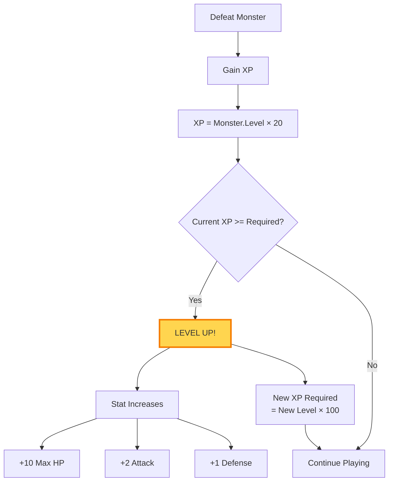

### Level Progression Table

| Level | XP Required | Total XP | Max HP | Attack | Defense |
|-------|-------------|----------|--------|--------|---------|
| 1     | 100         | 0        | 100    | 10     | 5       |
| 2     | 200         | 100      | 110    | 12     | 6       |
| 3     | 300         | 300      | 120    | 14     | 7       |
| 5     | 500         | 1000     | 140    | 18     | 9       |
| 10    | 1000        | 4500     | 190    | 28     | 14      |
| 20    | 2000        | 19000    | 290    | 48     | 24      |
| 50    | 5000        | 122500   | 590    | 108    | 54      |

### Floor Progression

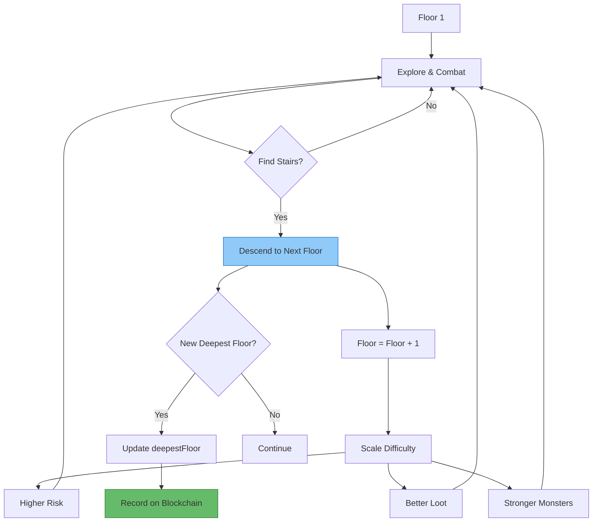

---

## Death & Permadeath

### Death Mechanics

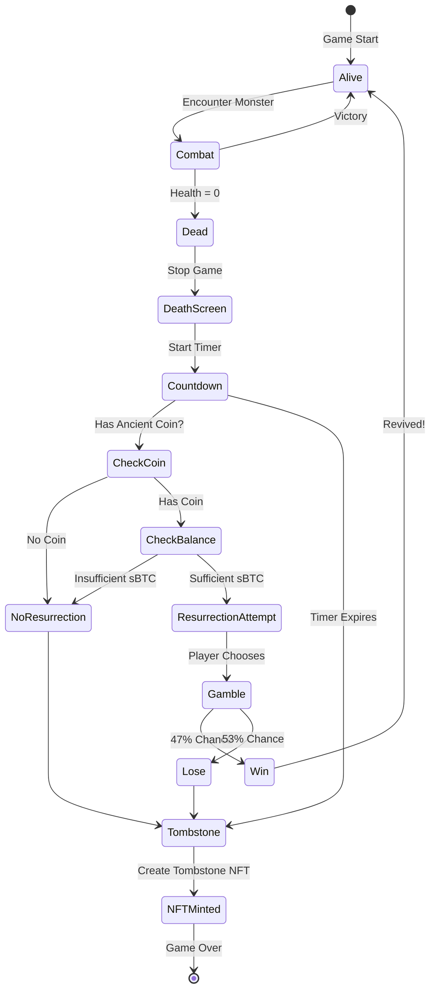

### Death Countdown

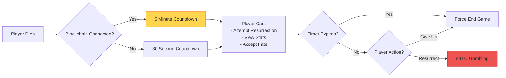

### Tombstone NFT

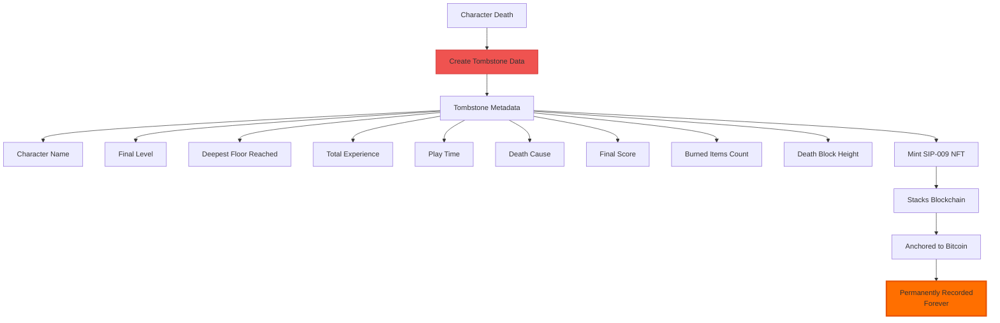

---

## Floor System

### Floor Generation

Each floor is **procedurally generated** with:

```mermaid
graph TD
    Generate[Generate Floor] --> Layout[Create Layout]

    Layout --> Rooms[5-10 Rooms]
    Layout --> Corridors[Connecting Corridors]

    Rooms --> Populate[Populate Floor]

    Populate --> Monsters[Place Monsters]
    Populate --> Treasures[Place Treasures]
    Populate --> Stairs[Place Stairs Down]

    Monsters --> Count[Monster Count<br/>= Floor × 2]
    Treasures --> TCount[Treasure Count<br/>= Floor + random(1-3)]
    Stairs --> OneStairs[Always 1 Staircase]

    Count --> Difficulty[Monster Difficulty<br/>= Floor Level]

    style Generate fill:#90caf9,stroke:#1976d2
```

### Floor Difficulty Scaling

```typescript
interface FloorConfig {
  floorNumber: number
  monsterCount: number
  treasureCount: number
  monsterLevelRange: [number, number]
  eliteChance: number
  ancientCoinChance: number
}

function getFloorConfig(floor: number): FloorConfig {
  return {
    floorNumber: floor,
    monsterCount: floor * 2,
    treasureCount: floor + random(1, 3),
    monsterLevelRange: [floor, floor + 2],
    eliteChance: min(0.05 + floor * 0.01, 0.25), // Max 25%
    ancientCoinChance: floor >= 10 ? 0.005 : 0  // 0.5% after floor 10
  }
}
```

---

## Ancient Satoshi Coin

### The Rarest Item

The **Ancient Satoshi Coin** is a mythic item with special properties:

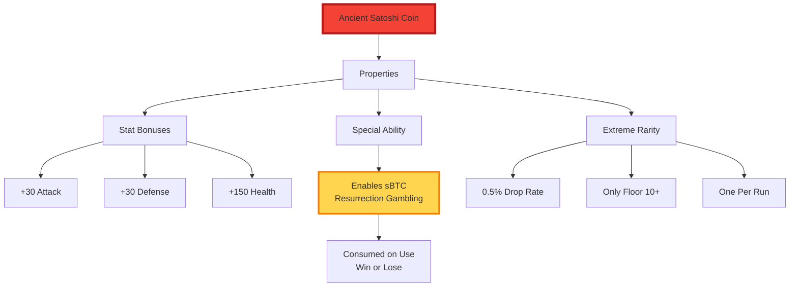

### Finding the Ancient Coin

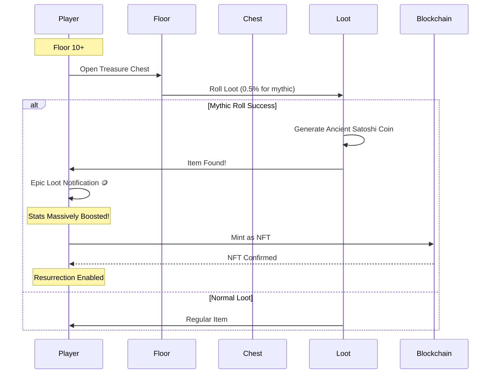

### Usage in Resurrection

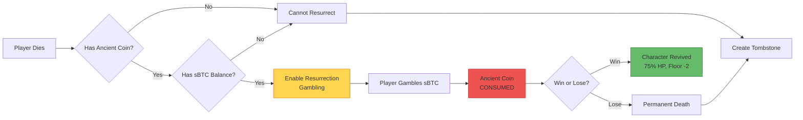

---

## Game Balance

### Risk vs Reward

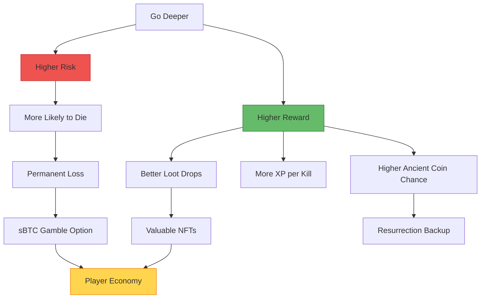

### Difficulty Curve

| Floor Range | Difficulty | Recommended Level | Notable Features |
|-------------|------------|-------------------|------------------|
| 1-5         | Easy       | 1-5              | Tutorial floors, common loot |
| 6-10        | Medium     | 6-10             | Rare loot starts appearing |
| 11-20       | Hard       | 11-20            | Ancient Coins possible, epic loot |
| 21-50       | Very Hard  | 21-50            | Legendary loot, elite monsters |
| 51+         | Extreme    | 51+              | Endgame content |

---

## Strategy Guide

### Optimal Play Patterns

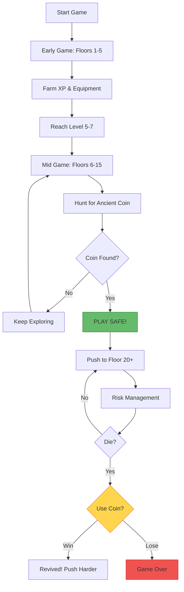

---

## Next Steps

For more information:
- [SYSTEM_ARCHITECTURE.md](./SYSTEM_ARCHITECTURE.md) - Overall system design
- [SBTC_RESURRECTION_FLOW.md](./SBTC_RESURRECTION_FLOW.md) - sBTC gambling mechanics
- [CONTRACT_INTERACTIONS.md](./CONTRACT_INTERACTIONS.md) - Smart contract details
- [DEPLOYMENT_GUIDE.md](./DEPLOYMENT_GUIDE.md) - Setup instructions

---

**Last Updated**: January 2025
**Version**: 1.0.0
**Authors**: Satoshi's Quest Development Team
