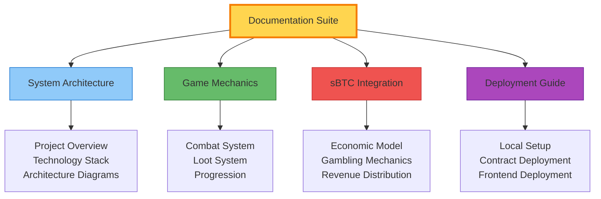
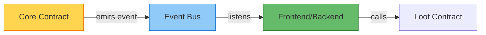
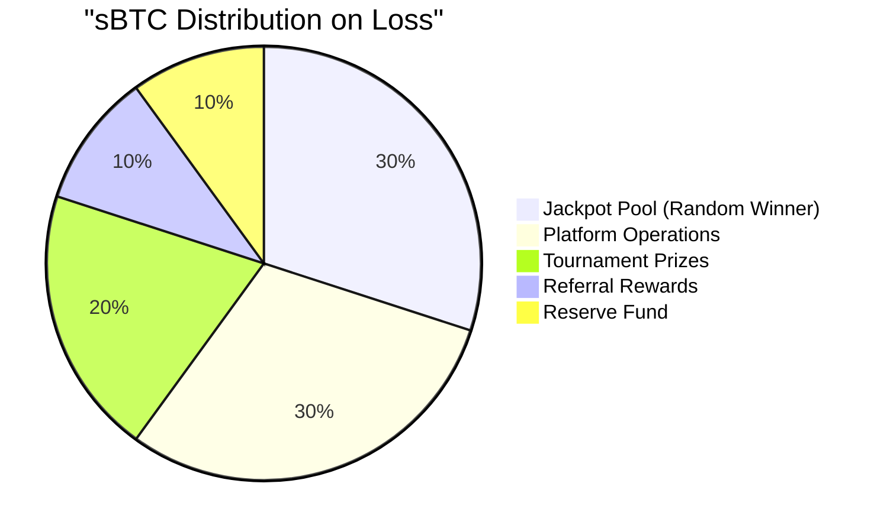
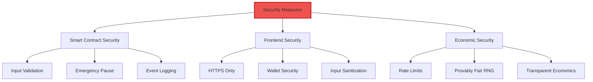
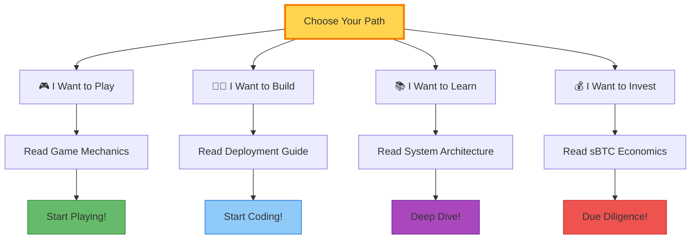

# Satoshi's Quest - Documentation Index

Welcome to the complete documentation for **Satoshi's Quest**, a revolutionary blockchain-based rogue-like dungeon crawler built on Bitcoin and Stacks.

---

## 📚 Documentation Overview

This documentation suite provides comprehensive coverage of the entire Satoshi's Quest ecosystem, from high-level architecture to deployment procedures.

---

## 📖 Core Documentation

### 1. [System Architecture](./SYSTEM_ARCHITECTURE.md)
**Complete technical overview of the entire system**

- ✅ High-level architecture with Mermaid diagrams
- ✅ Technology stack breakdown
- ✅ Smart contract architecture and event-driven design
- ✅ Frontend architecture and component hierarchy
- ✅ Game flow diagrams (onboarding, initialization, exploration, death)
- ✅ Data flow with sequence diagrams
- ✅ Integration points (wallet, contracts, sBTC)

**Start here if you want to:** Understand how the entire system works

---

### 2. [Game Mechanics](./GAME_MECHANICS.md)
**In-depth game design and rules documentation**

- ✅ Character system with stats and progression
- ✅ Combat system with damage formulas
- ✅ Loot system with 6 rarity tiers
- ✅ Experience and leveling mechanics
- ✅ Permadeath system
- ✅ Floor generation and difficulty scaling
- ✅ Ancient Satoshi Coin (the rarest item)
- ✅ Strategy guide and best practices

**Start here if you want to:** Understand how the game plays

---

### 3. [sBTC Resurrection Flow](./SBTC_RESURRECTION_FLOW.md)
**Deep dive into the revolutionary sBTC gambling mechanic**

- ✅ sBTC integration explanation
- ✅ Resurrection requirements and cost calculation
- ✅ Economic system and revenue distribution
- ✅ Provably fair gambling with random oracle
- ✅ Security safeguards and admin controls
- ✅ Complete user experience flow
- ✅ Player benefits and economic impact

**Start here if you want to:** Understand the sBTC resurrection system

---

### 4. [Deployment Guide](./DEPLOYMENT_GUIDE.md)
**Step-by-step instructions for deploying the entire project**

- ✅ Prerequisites and tool installation
- ✅ Local development setup
- ✅ Smart contract deployment (testnet & mainnet)
- ✅ Frontend deployment (Vercel/Netlify)
- ✅ Post-deployment configuration
- ✅ Testing and verification procedures
- ✅ Production checklist
- ✅ Troubleshooting guide

**Start here if you want to:** Deploy your own instance

---

## 🎯 Quick Start Guide

### For Players

1. **Read**: [Game Mechanics](./GAME_MECHANICS.md) - Learn how to play
2. **Read**: [sBTC Resurrection Flow](./SBTC_RESURRECTION_FLOW.md) - Understand resurrection
3. **Play**: Visit the game at [satoshiquest.io](https://satoshiquest.io)

### For Developers

1. **Read**: [System Architecture](./SYSTEM_ARCHITECTURE.md) - Understand the system
2. **Read**: [Deployment Guide](./DEPLOYMENT_GUIDE.md) - Set up locally
3. **Code**: Clone the repository and start building

### For Investors

1. **Read**: [sBTC Resurrection Flow](./SBTC_RESURRECTION_FLOW.md) - Understand the economic model
2. **Read**: [System Architecture](./SYSTEM_ARCHITECTURE.md) - Technical due diligence
3. **Review**: Contract code in `/contract/contracts/`

---

## 🔑 Key Concepts

### Event-Driven Architecture

Satoshi's Quest uses an innovative **event-driven architecture** to eliminate circular dependencies between smart contracts:

**Benefits:**
- ✅ No circular dependencies
- ✅ Easier deployment
- ✅ More flexible architecture
- ✅ Better separation of concerns

---

### sBTC Gambling Economy

The resurrection system creates a **sustainable player-driven economy**:

**Key Features:**
- 🎲 47% win rate (provably fair)
- 💰 110% payout on win
- 🎁 50% discount on next resurrection
- 🏆 Community-driven prize pools

---

## 🛠️ Technology Stack

### Smart Contracts
- **Language**: Clarity 3
- **Blockchain**: Stacks (Bitcoin L2)
- **Standards**: SIP-009 (NFTs), SIP-010 (Tokens)
- **Tools**: Clarinet 2.0+

### Frontend
- **Framework**: Next.js 15 (App Router)
- **UI**: React 19, Tailwind CSS 4, shadcn/ui
- **Game Engine**: Phaser 3.90
- **State**: Zustand, TanStack Query

### Integration
- **Wallet**: @stacks/connect
- **Blockchain**: @stacks/transactions
- **Bitcoin**: sBTC token (SIP-010)

---

## 📊 System Metrics

### Smart Contracts

| Contract | Functions | Events | NFT Type |
|----------|-----------|--------|----------|
| satoshi-quest-core | 15+ | 5+ | N/A |
| satoshi-quest-loot | 10+ | 3+ | SIP-009 |
| satoshi-quest-tombstone | 8+ | 2+ | SIP-009 |
| satoshi-quest-resurrection | 12+ | 6+ | N/A |
| random-oracle | 5+ | 1+ | N/A |

### Game Balance

| Metric | Value | Notes |
|--------|-------|-------|
| Starting HP | 100 | Base health |
| HP per level | +10 | Linear scaling |
| Attack per level | +2 | Linear scaling |
| Defense per level | +1 | Linear scaling |
| XP per level | Level × 100 | Exponential |
| Ancient Coin Drop | 0.5% | Floor 10+ only |
| Max Resurrections | 10 | Per character |

---

## 🔐 Security

### Audit Status

- ✅ **Code Review**: Complete (internal)
- ⏳ **External Audit**: Planned
- ✅ **Testnet Deployment**: Live
- ⏳ **Mainnet Deployment**: Pending audit

### Security Features

---

## 🤝 Contributing

We welcome contributions! Here's how to get started:

### For Code Contributors

1. **Fork** the repository
2. **Read** [System Architecture](./SYSTEM_ARCHITECTURE.md)
3. **Set up** local development (see [Deployment Guide](./DEPLOYMENT_GUIDE.md))
4. **Create** a feature branch
5. **Submit** a pull request

### For Documentation Contributors

1. **Identify** gaps in documentation
2. **Write** clear, concise content
3. **Use** Mermaid diagrams where helpful
4. **Submit** a pull request

### For Community Contributors

1. **Join** our Discord/Telegram
2. **Report** bugs via GitHub Issues
3. **Suggest** features via Discussions
4. **Share** your experience

---

## 📞 Support & Community

### Get Help

- 📖 **Documentation**: You're reading it!
- 💬 **Discord**: [Join our server](#)
- 🐦 **Twitter/X**: [@SatoshisQuest](#)
- 🐛 **Bug Reports**: [GitHub Issues](#)
- 💡 **Feature Requests**: [GitHub Discussions](#)

### Community Guidelines

1. **Be respectful** - Treat everyone with kindness
2. **Stay on topic** - Keep discussions relevant
3. **Help others** - Share your knowledge
4. **Report issues** - Help us improve
5. **Have fun** - Enjoy the game!

---

## 📝 Version History

### v1.0.0 (January 2025)
- ✅ Initial release
- ✅ Complete documentation suite
- ✅ Event-driven architecture
- ✅ sBTC resurrection system
- ✅ Testnet deployment

### Roadmap

**Q1 2025**
- External security audit
- Mainnet deployment
- Mobile optimization
- Additional loot items

**Q2 2025**
- Multiplayer features
- Guild system
- Leaderboards
- Tournament system

**Q3 2025**
- PvP combat
- Special events
- Cross-chain integration
- Mobile app

---

## 🙏 Acknowledgments

### Built With

- **Stacks** - Bitcoin L2 for smart contracts
- **sBTC** - Bitcoin on Stacks
- **Clarity** - Safe smart contract language
- **Next.js** - React framework
- **Phaser** - HTML5 game engine

### Special Thanks

- Stacks Foundation
- Bitcoin Community
- Open Source Contributors
- Early Testers & Players

---

## 📄 License

This project is licensed under the MIT License - see the LICENSE file for details.

---

## 🚀 What's Next?

Choose your adventure:

---

**Ready to begin your quest?** Start with any of the documentation files above!

**Questions?** Open an issue or join our community channels.

**Want to contribute?** We'd love your help! Check out the contributing guidelines.

---

**Last Updated**: January 2025
**Version**: 1.0.0
**Maintained By**: Satoshi's Quest Development Team

---

*May Satoshi guide your path through the dungeons of Bitcoin.*
