# Satoshi's Quest - sBTC Resurrection Flow Documentation

## Table of Contents
1. [Overview](#overview)
2. [sBTC Integration](#sbtc-integration)
3. [Resurrection Mechanism](#resurrection-mechanism)
4. [Economic System](#economic-system)
5. [Provably Fair Gambling](#provably-fair-gambling)
6. [Revenue Distribution](#revenue-distribution)
7. [Security & Safeguards](#security--safeguards)
8. [User Experience Flow](#user-experience-flow)

---

## Overview

The **sBTC Resurrection System** is the revolutionary core mechanic of Satoshi's Quest. It allows players to use **real Bitcoin** (via sBTC) to gamble for a second chance when their character dies.

### Key Innovation

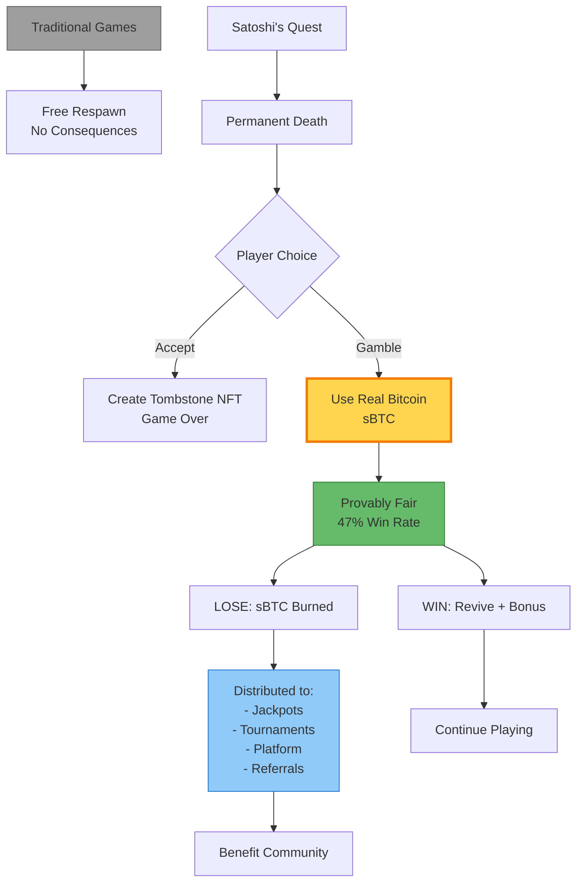

---

## sBTC Integration

### What is sBTC?

**sBTC (Stacks Bitcoin)** is a SIP-010 fungible token that represents Bitcoin 1:1 on the Stacks blockchain.

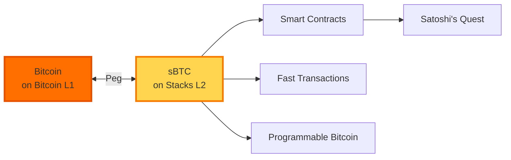

### sBTC Contract Integration

```clarity
;; In satoshi-quest-resurrection.clar
(define-constant SBTC_CONTRACT 'SM3VDXK3WZZSA84XXFKAFAF15NNZX32CTSG82JFQ4.sbtc-token)

;; Transfer sBTC from player to contract
(contract-call? .sbtc-token transfer
  amount
  tx-sender
  (as-contract tx-sender)
  none)

;; Return sBTC from contract to player (on win)
(as-contract
  (contract-call? .sbtc-token transfer
    payout-amount
    tx-sender
    player
    none))
```

### Balance Checking

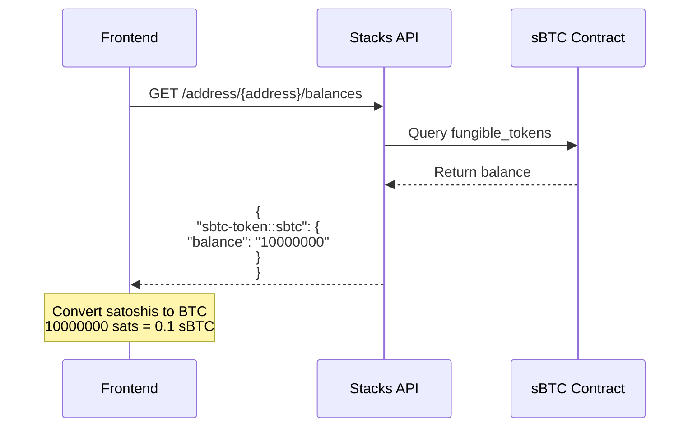

---

## Resurrection Mechanism

### Requirements

To attempt resurrection, a player must have:

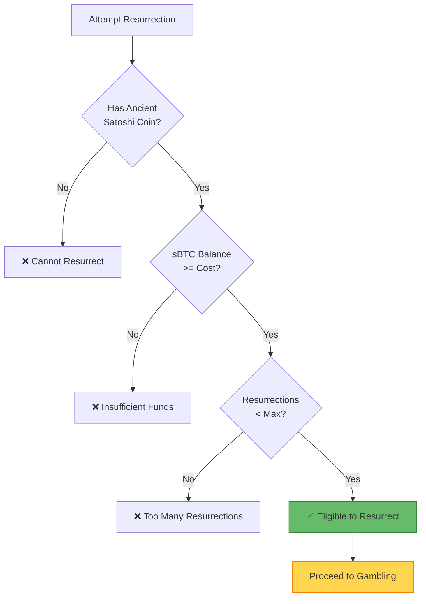

### Cost Calculation

```clarity
;; Base cost scaling with character level
(define-private (calculate-resurrection-cost (level uint) (death-count uint))
  (let (
    (base-cost ANCIENT_COIN_BASE_COST_SATS) ;; 100,000 satoshis (0.001 BTC)
    (level-multiplier (+ u100 (* level u10))) ;; +10% per level
    (death-multiplier (+ u100 (* death-count DEATH_MULTIPLIER))) ;; +50% per previous death
  )
  ;; Cost = base * (1 + level*0.1) * (1 + deaths*0.5)
  (/ (* (* base-cost level-multiplier) death-multiplier) u10000))
)
```

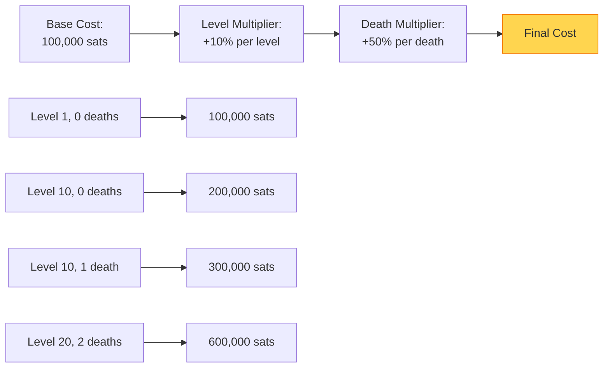

### Maximum Resurrections

```clarity
(define-constant MAX_RESURRECTIONS_PER_CHARACTER u10)

;; Track per character
(define-map character-resurrection-count
  (string-ascii 64)  ;; character-id
  uint               ;; resurrection count
)
```

---

## Economic System

### Revenue Distribution Model

When a player **loses** the resurrection gamble, their sBTC is distributed across multiple pools:

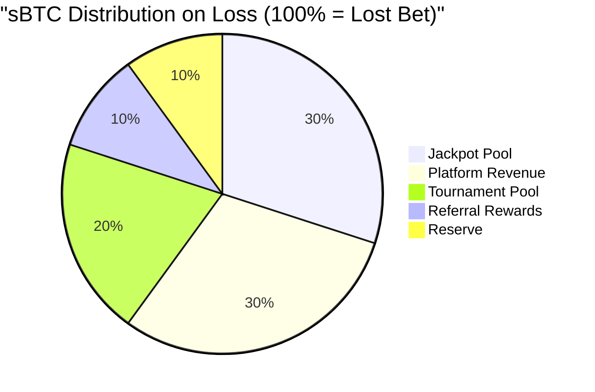

### Pool Breakdown

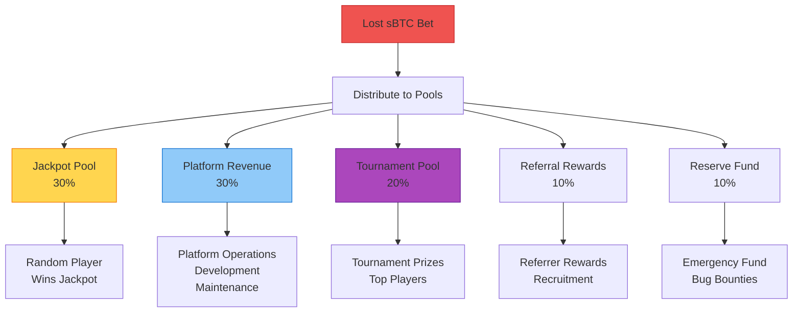

### Winner Rewards

When a player **wins** the resurrection gamble:

```clarity
;; Winner gets back bet + 10% bonus
(define-constant WINNER_BONUS_PERCENTAGE u110) ;; 110% return

;; Winner also gets 50% discount on next resurrection
(define-constant WINNER_RESURRECTION_DISCOUNT u50) ;; 50% off
```

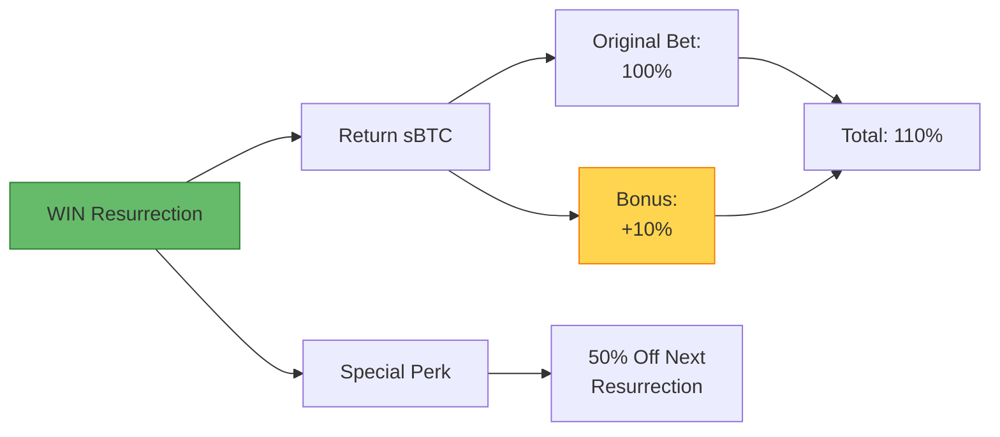

---

## Provably Fair Gambling

### Random Oracle System

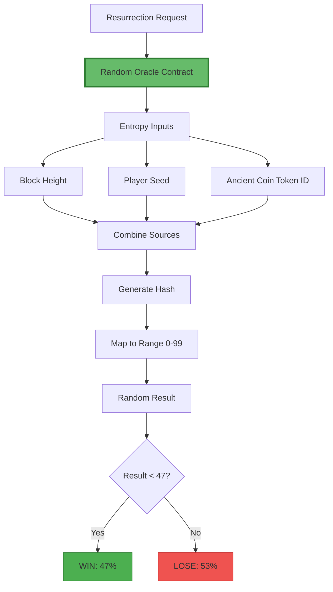

### Verifiable Fairness

```clarity
;; In random-oracle.clar
(define-read-only (get-resurrection-gamble-result
  (character-id (string-ascii 64))
  (player principal)
  (ancient-coin-token-id uint))

  (let (
    ;; Create unique seed from multiple sources
    (coin-entropy ancient-coin-token-id)
    (unique-seed (+
      coin-entropy
      stacks-block-height
      (* stacks-block-height u12345) ;; Additional entropy
    ))
    (result (unwrap-panic (get-coin-flip unique-seed)))
  )
  {
    won: (< result u47), ;; Win if result < 47 (47% chance)
    random-value: result,
    seed-used: unique-seed,
    block-height: stacks-block-height,
  })
)
```

### Transparency

All gambling results are **on-chain** and can be verified:

```typescript
// Anyone can verify the result
async function verifyGamblingResult(txId: string) {
  const tx = await fetchTransaction(txId)
  const events = tx.events

  const gamblingEvent = events.find(e =>
    e.event_type === 'print' &&
    e.event_data.event === 'resurrection-attempt'
  )

  return {
    characterId: gamblingEvent.character_id,
    blockHeight: gamblingEvent.block_height,
    randomValue: gamblingEvent.random_value,
    won: gamblingEvent.random_value < 47,
    verifiable: true // All inputs on-chain
  }
}
```

---

## Revenue Distribution

### Distribution Flow

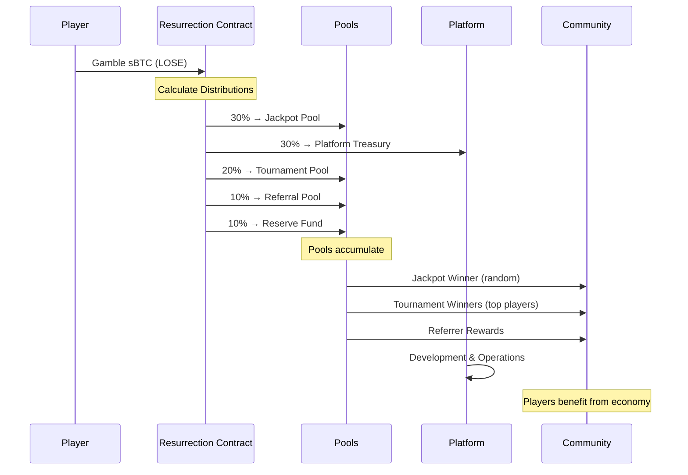

### Jackpot System

```clarity
;; Jackpot accumulation
(define-data-var jackpot-pool uint u0)

;; On each loss, add to jackpot
(define-private (add-to-jackpot (amount uint))
  (var-set jackpot-pool (+ (var-get jackpot-pool) amount))
)

;; Jackpot winner selection (triggered periodically)
(define-public (trigger-jackpot-draw)
  (let (
    (jackpot-amount (var-get jackpot-pool))
    (winner (select-random-active-player)) ;; From recent players
  )
  (try! (as-contract
    (contract-call? .sbtc-token transfer
      jackpot-amount
      tx-sender
      winner
      none)))
  (var-set jackpot-pool u0)
  (print {
    event: "jackpot-won",
    winner: winner,
    amount: jackpot-amount,
  })
  (ok true))
)
```

### Tournament System

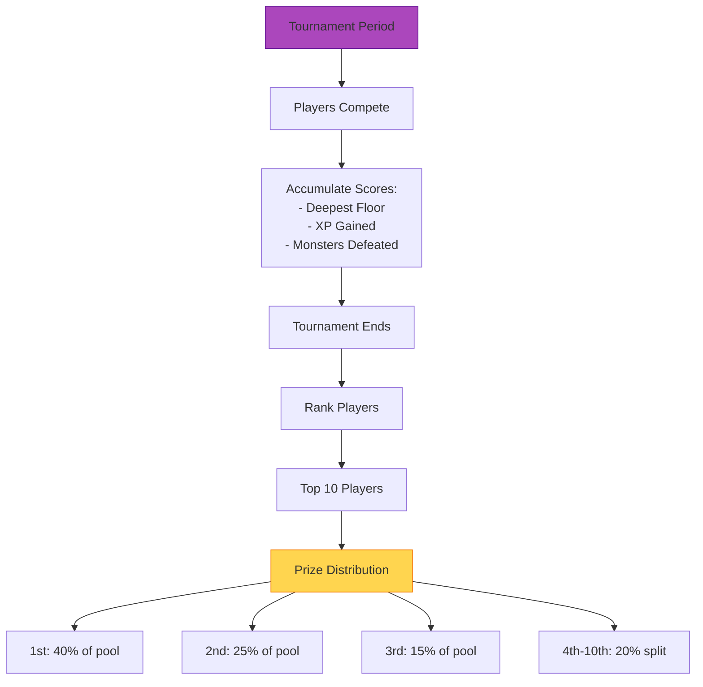

---

## Security & Safeguards

### Contract Security

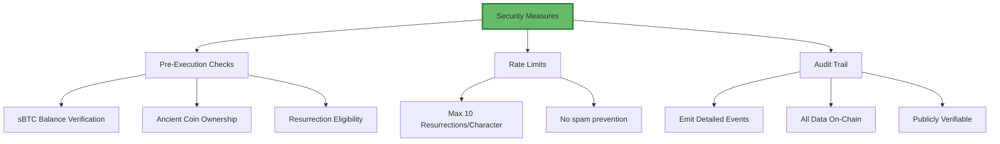

### Input Validation

```clarity
;; Comprehensive validation
(define-public (gamble-for-resurrection
  (character-id (string-ascii 64))
  (ancient-coin-token-id uint)
  (sbtc-amount uint))

  (let (
    (player tx-sender)
    (user-sbtc-balance (get-sbtc-balance player))
    (resurrection-count (get-resurrection-count character-id))
  )

  ;; Validate all inputs
  (asserts! (is-valid-character-id character-id) ERR_INVALID_PRICE_DATA)
  (asserts! (var-get resurrection-enabled) ERR_UNAUTHORIZED)
  (asserts! (< resurrection-count MAX_RESURRECTIONS_PER_CHARACTER)
    ERR_TOO_MANY_RESURRECTIONS)
  (asserts! (>= sbtc-amount min-gambling-cost) ERR_INSUFFICIENT_PAYMENT)
  (asserts! (>= user-sbtc-balance sbtc-amount) ERR_INSUFFICIENT_PAYMENT)

  ;; Proceed with gambling...
  )
)
```

### Emergency Controls

```clarity
;; Admin can pause system in emergency
(define-data-var resurrection-enabled bool true)

(define-public (toggle-resurrection-system (enabled bool))
  (begin
    (asserts! (is-contract-owner) ERR_UNAUTHORIZED)
    (var-set resurrection-enabled enabled)
    (print { event: "system-toggled", enabled: enabled })
    (ok true)
  )
)
```

---

## User Experience Flow

### Complete User Journey

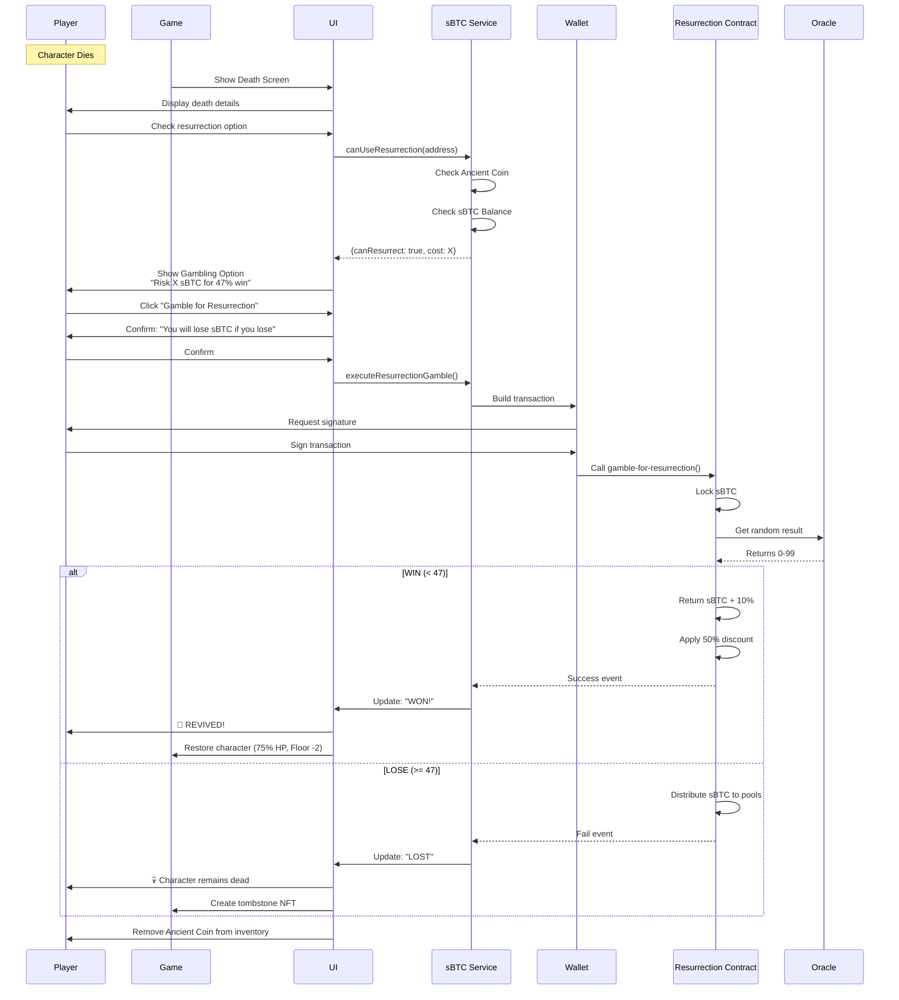

### Frontend Implementation

```typescript
// In PhaserGameClient.tsx
const handleResurrection = async () => {
  try {
    setIsProcessing(true)

    // 1. Check eligibility
    const check = await sbtcService.canUseResurrection(walletAddress)
    if (!check.canResurrect) {
      addCombatLog(`❌ ${check.reason}`)
      return
    }

    // 2. Get cost
    const cost = sbtcService.getResurrectionCost(character.level)

    // 3. Confirm with user
    addCombatLog(`₿ Gambling ${sbtcService.formatSbtcAmount(cost)} sBTC`)
    addCombatLog(`⚡ 47% chance to win. sBTC burned on loss!`)

    // 4. Execute gamble
    const result = await sbtcService.executeResurrectionGamble(
      walletAddress,
      cost,
      character.id
    )

    // 5. Handle result
    if (result.won) {
      // WIN: Revive character
      setCharacter(prev => ({
        ...prev,
        isAlive: true,
        health: Math.floor(prev.maxHealth * 0.75),
        currentFloor: Math.max(1, prev.currentFloor - 2)
      }))
      setDeathCountdown(null)
      addCombatLog('⚡ RESURRECTION SUCCESS!')
      addCombatLog(`💰 Received ${sbtcService.formatSbtcAmount(cost * 1.1)} sBTC`)
    } else {
      // LOSE: Character stays dead
      addCombatLog('💀 Resurrection failed...')
      addCombatLog(`💸 ${sbtcService.formatSbtcAmount(cost)} sBTC burned`)
    }

    // 6. Update balance
    const newBalance = await sbtcService.getSbtcBalance(walletAddress)
    setSbtcBalance(newBalance)

    // 7. Remove Ancient Coin
    setInventory(prev => prev.filter(item => item.name !== 'Ancient Satoshi Coin'))
    setHasAncientCoin(false)

  } catch (error) {
    addCombatLog(`❌ Error: ${error.message}`)
  } finally {
    setIsProcessing(false)
  }
}
```

---

## Economic Impact

### Player Benefits

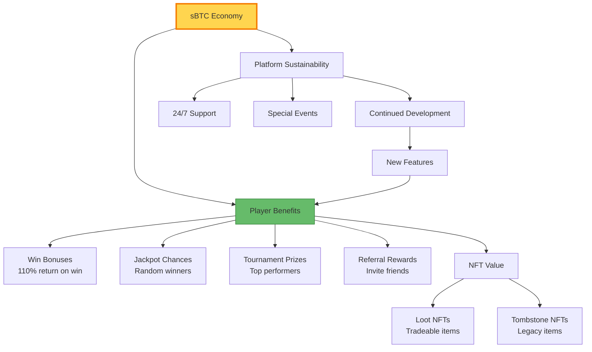

### Sustainability Model

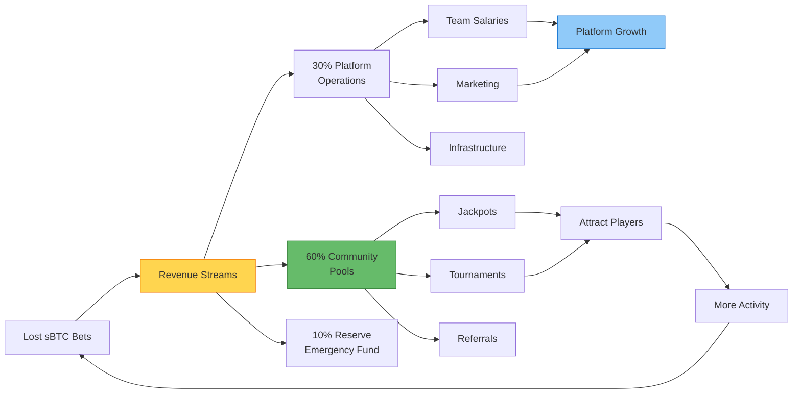

---

## Best Practices

### For Players

1. **Only gamble what you can afford to lose** - sBTC is real Bitcoin
2. **Save Ancient Coins** - Use them strategically on deep floors
3. **Understand the odds** - 47% win rate means 53% loss rate
4. **Check your balance** - Ensure sufficient sBTC before deep runs
5. **Consider the cost** - Higher levels = higher resurrection cost

### For Developers

1. **Always validate inputs** - Check balances, ownership, eligibility
2. **Emit detailed events** - Enable transparency and debugging
3. **Test randomness** - Verify fair distribution over many trials
4. **Secure fund transfers** - Use post-conditions and assertions
5. **Emergency controls** - Ability to pause system if needed

---

## Next Steps

For more information:
- [SYSTEM_ARCHITECTURE.md](./SYSTEM_ARCHITECTURE.md) - Overall system design
- [GAME_MECHANICS.md](./GAME_MECHANICS.md) - Game rules and progression
- [CONTRACT_INTERACTIONS.md](./CONTRACT_INTERACTIONS.md) - Smart contract details
- [DEPLOYMENT_GUIDE.md](./DEPLOYMENT_GUIDE.md) - Setup instructions

---

**Last Updated**: January 2025
**Version**: 1.0.0
**Authors**: Satoshi's Quest Development Team
