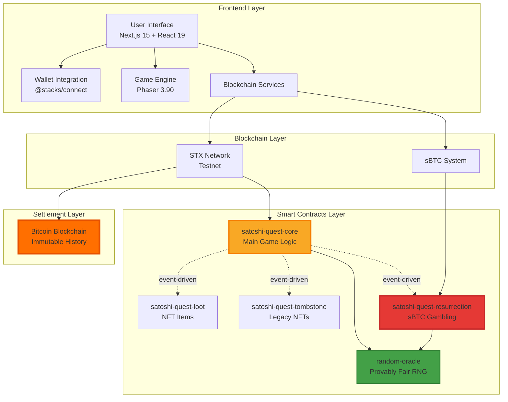
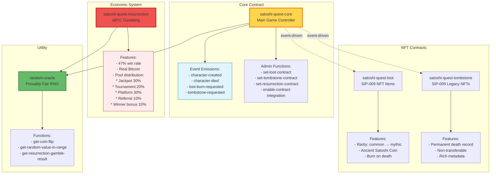
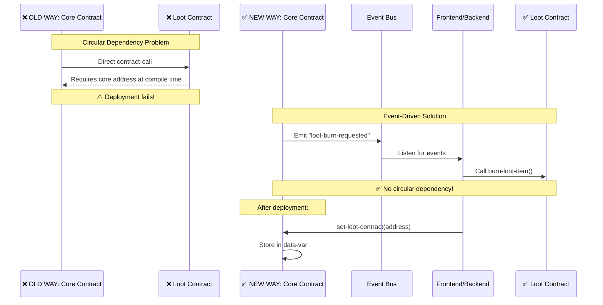
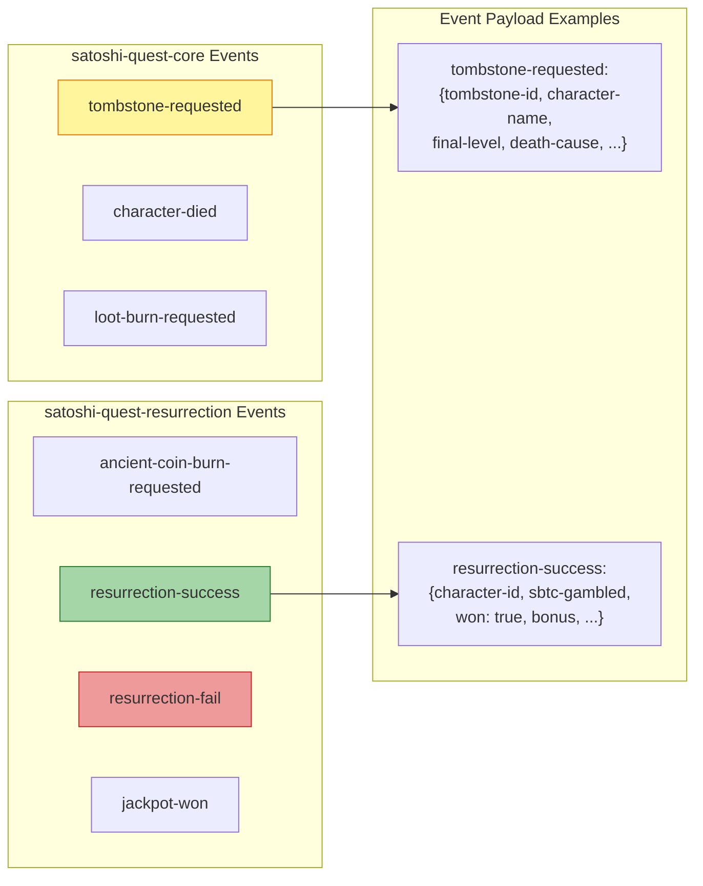
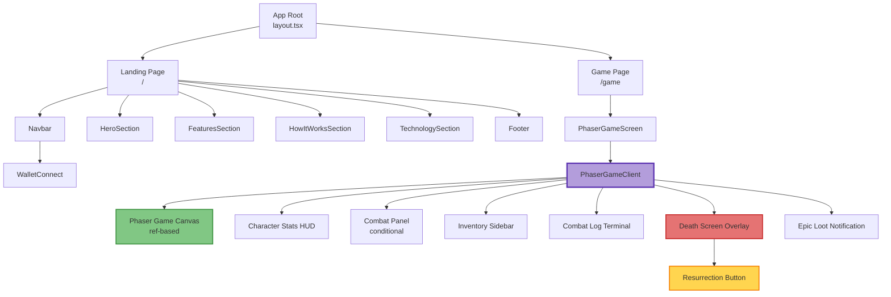
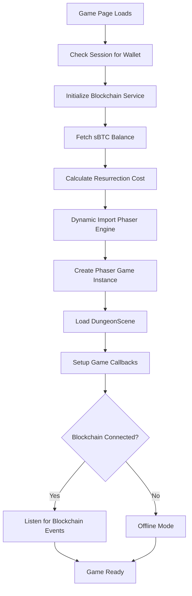
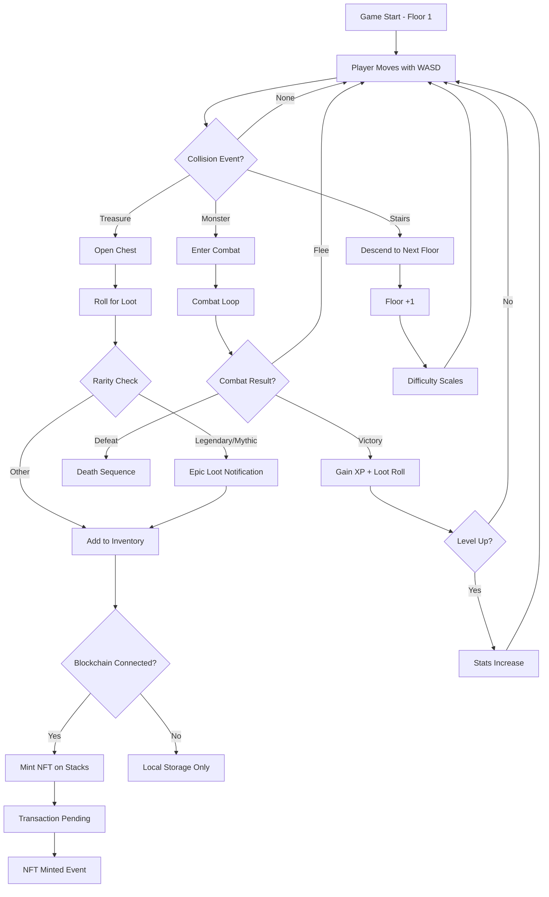
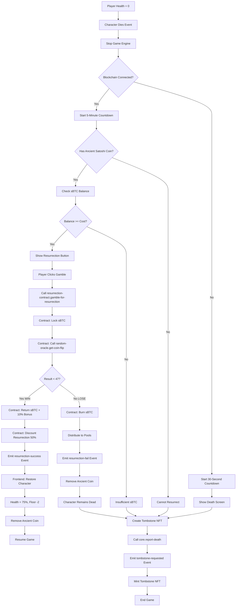
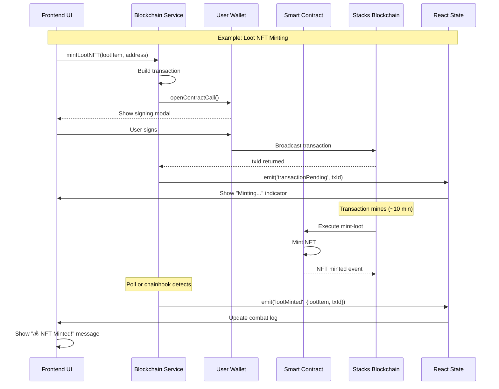
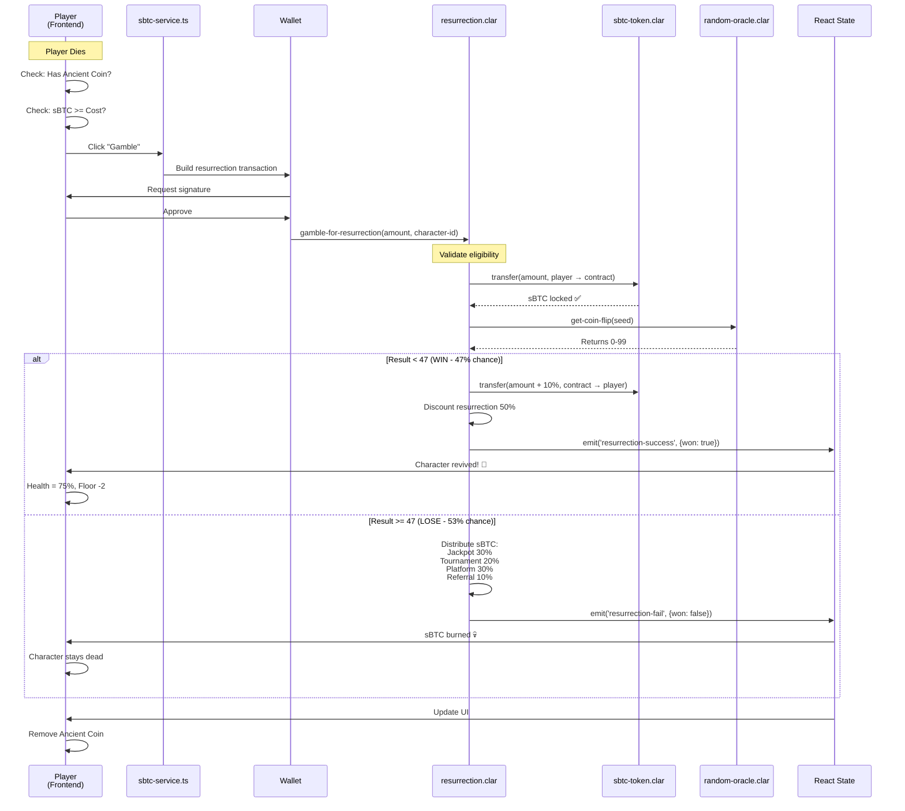

# Satoshi's Quest - System Architecture Documentation

## Table of Contents
1. [Project Overview](#project-overview)
2. [High-Level Architecture](#high-level-architecture)
3. [Technology Stack](#technology-stack)
4. [Smart Contract Architecture](#smart-contract-architecture)
5. [Frontend Architecture](#frontend-architecture)
6. [Game Flow](#game-flow)
7. [Data Flow](#data-flow)
8. [Integration Points](#integration-points)

---

## Project Overview

**Satoshi's Quest** is a revolutionary blockchain-based rogue-like dungeon crawler that leverages Bitcoin's immutability and Stacks smart contracts to create a game with **permanent consequences** and **real digital scarcity**.

### Core Concept
- **Permadeath**: When you die, it's permanent - recorded on the Bitcoin blockchain forever
- **NFT Loot**: All items are SIP-009 NFTs with real value
- **sBTC Resurrection**: Use actual Bitcoin (via sBTC) to gamble for a second chance
- **Immutable Legacy**: Your achievements are forever etched into Bitcoin's history

### Key Innovation: sBTC Gambling Mechanic
Unlike traditional blockchain games, Satoshi's Quest implements a **provably fair gambling system** where players can:
- Find rare "Ancient Satoshi Coins" (NFTs) in deep dungeons
- Gamble **real sBTC** (Bitcoin on Stacks) for resurrection
- 47% chance to win resurrection + bonus
- All gambling revenue flows into **player-driven economy** (jackpots, tournaments, referrals)

---

## High-Level Architecture



---

## Technology Stack

### Frontend Layer
```typescript
{
  "framework": "Next.js 15.5.2 (App Router + Turbopack)",
  "rendering": "Client-Side with SSR capabilities",
  "ui": {
    "components": "shadcn/ui + Radix UI",
    "styling": "Tailwind CSS 4",
    "theme": "next-themes (dark/light mode)",
    "icons": "Lucide React"
  },
  "gameEngine": "Phaser 3.90.0",
  "stateManagement": {
    "local": "Zustand 5.0.8",
    "server": "@tanstack/react-query 5.87.4"
  },
  "forms": "react-hook-form + zod validation",
  "animations": "framer-motion 12.23.12"
}
```

### Blockchain Integration
```typescript
{
  "wallet": "@stacks/connect 8.2.0",
  "transactions": "@stacks/transactions 7.2.0",
  "network": "@stacks/network 7.2.0",
  "api": "@stacks/blockchain-api-client 8.13.0",
  "sbtc": "sbtc 0.3.2",
  "http": "axios 1.11.0"
}
```

### Smart Contracts
```clarity
{
  "language": "Clarity 3",
  "tools": "Clarinet (development & testing)",
  "network": "Stacks Testnet (Nakamoto)",
  "bitcoin": "sBTC for Bitcoin integration",
  "standards": {
    "nfts": "SIP-009 (NFT Standard)",
    "tokens": "SIP-010 (Fungible Token)"
  }
}
```

---

## Smart Contract Architecture

### Contract Hierarchy



### Event-Driven Architecture (Key Innovation)

**Problem Solved**: Circular dependencies between contracts
**Solution**: Event emission + post-deployment contract linking



#### Event Types Emitted



---

## Frontend Architecture

### Directory Structure
```
frontend/
├── app/
│   ├── layout.tsx (root layout with providers)
│   ├── page.tsx (landing page with wallet connect)
│   └── game/
│       └── page.tsx (game route)
│
├── components/
│   ├── game/
│   │   ├── PhaserGameClient.tsx (Main game logic)
│   │   ├── PhaserGameScreen.tsx (Game wrapper)
│   │   ├── dashboard/ (UI overlays)
│   │   └── screens/ (Death, notifications)
│   │
│   ├── wallet/
│   │   ├── WalletConnect.tsx (Connection UI)
│   │   └── WalletDropdown.tsx (User menu)
│   │
│   ├── sections/ (Landing page sections)
│   ├── layout/ (Navbar, Footer)
│   └── ui/ (shadcn components)
│
├── lib/
│   ├── game/
│   │   └── phaser-engine.ts (Phaser game initialization)
│   ├── services/
│   │   ├── wallet-service.ts (Wallet abstraction)
│   │   ├── blockchain-game-service.ts (Contract calls)
│   │   └── sbtc-service.ts (sBTC gambling)
│   └── types/
│       └── game.ts (TypeScript interfaces)
│
└── public/ (Game assets: sprites, tilesets, audio)
```

### Component Hierarchy



### State Management Strategy

```typescript
// Game State (local to PhaserGameClient)
const [character, setCharacter] = useState<GameCharacter>({...})
const [currentMonster, setCurrentMonster] = useState<Monster | null>(null)
const [inventory, setInventory] = useState<LootItem[]>([])
const [isInCombat, setIsInCombat] = useState(false)

// Blockchain State
const [isBlockchainConnected, setIsBlockchainConnected] = useState(false)
const [sbtcBalance, setSbtcBalance] = useState<SbtcBalance>({...})
const [pendingTransactions, setPendingTransactions] = useState<Set<string>>(new Set())

// Death & Resurrection State
const [deathCountdown, setDeathCountdown] = useState<number | null>(null)
const [canResurrect, setCanResurrect] = useState(false)
const [hasAncientCoin, setHasAncientCoin] = useState(false)
```

### Service Layer Architecture

#### Wallet Service (`wallet-service.ts`)
```typescript
class WalletService {
  // Wallet connection via @stacks/connect
  connectWallet(): Promise<WalletConnectionResult>
  disconnectWallet(): Promise<void>
  getCurrentWalletData(): Promise<WalletConnectionResult | null>

  // Balance queries
  getStxBalance(): Promise<number>
  getSbtcBalance(): Promise<number>

  // Utility
  formatBalance(amount: number, token: 'STX' | 'SBTC'): string
  getNetworkInfo(): NetworkInfo
}
```

#### Blockchain Game Service (`blockchain-game-service.ts`)
```typescript
class BlockchainGameService extends EventEmitter {
  // Initialization
  initialize(walletAddress: string): Promise<void>

  // Contract Interactions
  mintLootNFT(loot: LootItem, recipient: string): Promise<string>
  processCharacterDeath(character: GameCharacter, cause: string, playTime: number): Promise<string>

  // Events
  on('lootMinted', callback)
  on('characterDied', callback)
  on('characterResurrected', callback)
  on('transactionPending', callback)
  on('transactionConfirmed', callback)
  on('error', callback)
}
```

#### sBTC Service (`sbtc-service.ts`)
```typescript
class SbtcService {
  // Balance & Cost
  getSbtcBalance(address: string): Promise<SbtcBalance>
  getResurrectionCost(characterLevel: number): number
  formatSbtcAmount(sats: number): string

  // Resurrection
  canUseResurrection(address: string): Promise<{
    canResurrect: boolean,
    reason?: string,
    sbtcBalance?: SbtcBalance
  }>

  executeResurrectionGamble(
    address: string,
    amount: number,
    characterId: string
  ): Promise<{
    success: boolean,
    won: boolean,
    message: string,
    txId?: string
  }>
}
```

---

## Game Flow

### 1. Player Onboarding
```mermaid
graph TD
    A[Visit Landing Page] --> B{Wallet Connected?}
    B -->|No| C[Click Connect Wallet]
    C --> D[@stacks/connect Modal]
    D --> E[Hiro/Leather/Xverse Wallet]
    E --> F[User Approves]
    F --> G[Wallet Data Stored in Session]
    G --> H[Show STX & sBTC Balances]
    B -->|Yes| H
    H --> I[Click Start Game]
    I --> J[Navigate to /game]
```

### 2. Game Initialization


### 3. Dungeon Exploration


### 4. Death & Resurrection Flow


---

## Data Flow

### Contract to Frontend Communication



### sBTC Gambling Flow (Data Perspective)



---

## Integration Points

### Wallet Integration (@stacks/connect)
```typescript
// Connect wallet
const { userSession } = await showConnect({
  appDetails: {
    name: "Satoshi's Quest",
    icon: window.location.origin + "/logo.png"
  },
  redirectTo: "/",
  onFinish: () => {
    const userData = userSession.loadUserData()
    const address = userData.profile.stxAddress.testnet
    // Store in session, update UI
  }
})
```

### Smart Contract Calls
```typescript
// Example: Mint Loot NFT
import { makeContractCall, PostConditionMode } from '@stacks/transactions'

const txOptions = {
  contractAddress: 'ST2F3J...',
  contractName: 'satoshi-quest-loot',
  functionName: 'mint-loot',
  functionArgs: [
    stringUtf8Cv(lootItem.name),
    uintCv(lootItem.rarity),
    principalCv(recipientAddress)
  ],
  network: new StacksTestnet(),
  postConditionMode: PostConditionMode.Deny,
  postConditions: [/* NFT mint post condition */],
  senderKey: privateKey
}

const transaction = await makeContractCall(txOptions)
const result = await broadcastTransaction(transaction, network)
```

### sBTC Integration
```typescript
// Check sBTC balance (using @stacks/blockchain-api-client)
const balanceUrl = `${API_URL}/extended/v1/address/${address}/balances`
const response = await fetch(balanceUrl)
const data = await response.json()
const sbtcBalance = data.fungible_tokens['sbtc-token::sbtc']?.balance || 0

// Execute sBTC transfer (in resurrection contract)
(contract-call? .sbtc-token transfer amount tx-sender TREASURY_ADDRESS)
```

---

## Next Steps

For detailed information on specific subsystems, see:
- [CONTRACT_INTERACTIONS.md](./CONTRACT_INTERACTIONS.md) - Detailed contract call flows
- [GAME_MECHANICS.md](./GAME_MECHANICS.md) - Game rules and progression
- [SBTC_RESURRECTION_FLOW.md](./SBTC_RESURRECTION_FLOW.md) - Deep dive into gambling mechanic
- [DEPLOYMENT_GUIDE.md](./DEPLOYMENT_GUIDE.md) - How to deploy and configure

---

**Last Updated**: January 2025
**Version**: 1.0.0
**Authors**: Satoshi's Quest Development Team
